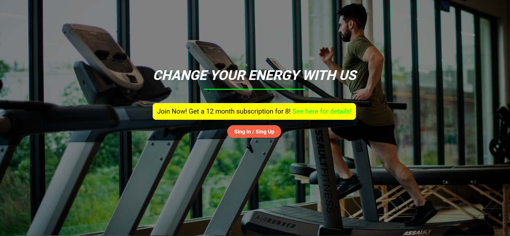
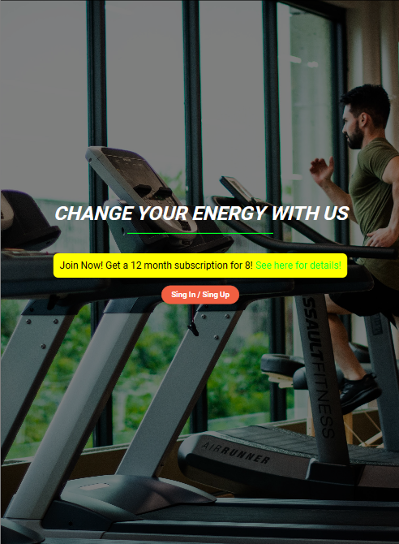
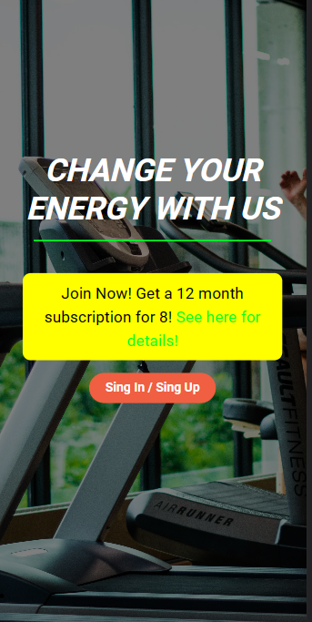
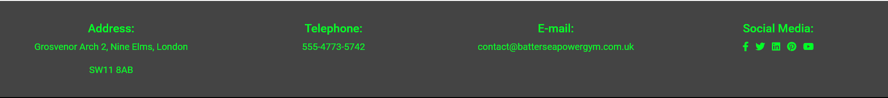

# Batersea Gym
## Table content
##  UX
* ### Project Goals

    + The gym is interested in attracting and retaining members, give information about services and booking. 
* ### Users Goals

    + Members and potential members can get information about services bookings and procedures

* ### Desing Choices

  + Showcase photos of people having fun exercising in the gym and any other media to motivate people to come.

  + Provide information on the gym's location, opening hours, contact details and any external resources.
 Provide detail on the organised classes in the gym and their schedule.

##  Features
* ### Existing Features:

    + ### Index.html
    
    ### Navigation Bar:
    Featured on all three pages, the full responsive navigation bar includes links to the Logo, Home page, Facilities, Swimmingpool, Contact and Social Media links. It is identical in each page to allow for easy navigation.This section will allow the user to easily navigate from page to page across all devices.
    + Computer

    

    + Tablet

    

    + Mobile

    

    ### Home Page:
    I choose the name Battersea Power Gym because I live in Battersea and making a website for a gym seemed adequate to me. Thinking of the Battersea Power Station, this made me reference to electricity, energy, power and tried to drop this in the image of the website.

    I choose this green colour for the logo and as leitmotiv to refer at the green colour from the batterie signal in the electronic devices. You can see on the index page a red button at the bottom, the offer in yellow in the middle and at the top the green colour in the logo and links for social networks, this tries to refer to the level of batteries. And when you go over the logo or click on it, it also turns green, meaning you will recharge your batteries with us, you will feel stronger. The background image was selected, because in addition to someone running in a gym, it has the green of the trees.
    + Computer

    

    + Tablet

    

    + Mobile

    

    ### Facilities:
    You can get here directly fron the navegation bar. I choose this kind of blue as the background colour in the Facilities section, to signify trust, loyalty, sincerity, confidence and stability. I put the most relevant facilities with icons and with a brief explanation, if you want more, you can click on the buttons.
    + Computer

    

    + Tablet

    

    + Mobile

     
    
    ### Contact:
    Also you can get directly here  from the navigation bar. With a large map the location of the Gym is shown and below in footer that shows the contact information.
    + Computer

    

    + Tablet

    

    + Mobile

    
    
    

    + ### Footer
    On footer text in the green colour of the gym, basic information, and background in black colour to contrast the letters.
    I tried not to show too much information at first sight, just the most important and necessary, clear and easy access, meaning confidence, style, dynamism and positive energy.
        + Computer

    

    + Tablet

    

    + Mobile

    

    + ### Sign
    Here I choose this picture to meaning empathy and common action: like everybody is happy joining to the gym or everybody is happy booking. About forms, the curvy shape and transparent padding it try to mean transparency, dynamism and style.
    + Computer

    

    + Tablet

    

    + Mobile

     

    + ### Swimming Pool
    A photo of the swimming pool, the benefits of swimming to motivate swimming and create a need, the services we can offer you and the option to register.
    + Computer

    

    + Tablet

    

    + Mobile

    

    + ### Error 404
    A funny photo of a man making a lot of effort to convey that we are working hard to achieve what they are looking for. And the message that the page was not found.
    + Computer

    

    + Tablet

    

    + Mobile

    

* ### Wireframes

    * #### Index

        + [Computer](assets/images/IndexBPG.png) 

        + [Tablet](assets/images/IndexIPadBPG.png)

        + [Mobile](assets/images/IndexPhoneBPG.png)

    * ### Sign
      
        + [Computer](assets/images/SignBPG.png)

        + [Tablet](assets/images/SignIpadBPG.png)

        + [Mobile](assets/images/SignPhoneBPG.png)

    * ### Swimming    

        + [Computer](assets/images/Swimming.png)

        + [Tablet](assets/images/SwimmingIpadBPG.png)

        + [Mobile](assets/images/SwimmingPhoneBPG.png)

    * ### 404

        + [Computer](assets/images/404BPG.png)

        + [Tablet](assets/images/404IPadBPG.png)

        + [Mobile](assets/images/404PhoneBPG.png)

## Testing

There were some issues with the links not working. The problem was how I had written them, but later I knew how to write them, so I had to wait for the server to apply the changes in the browser, the changes are not applied immediately. And the same with the layout of each device.

Others drawbacks was the Sign In link button on the index page. It is not allowed to put an "< a >" inside the button. So I googled and found "onclick" function and with this I fixed the problem.

  ### Index.html

  - HTML
    - I have two messages from W3C: [W3C validator](https://validator.w3.org/nu/?doc=https%3A%2F%2Fhernanpd.github.io%2Fbattersea-gym%2Findex.html)

    + Error: Bad value 100% for attribute width on element iframe: Expected a digit but saw % instead: I don't know of any other way to fill in 100% width on each device.

    + Warning: Section lacks heading. Consider using h2-h6 elements to add identifying headings to all sections, or else use a div element instead for any cases where no heading is needed: I'd rather not put a title at all.

  - CSS
    - No errors were found when passing through the official [(Jigsaw) validator](https://jigsaw.w3.org/css-validator/validator?uri=https%3A%2F%2Fhernanpd.github.io%2Fbattersea-gym%2Findex.html&profile=css3svg&usermedium=all&warning=1&vextwarning=&lang=en)

  ### Sign.html
  - HTML
    - No errors were returned when passing through the official [W3C validator](https://validator.w3.org/nu/?doc=https%3A%2F%2Fhernanpd.github.io%2Fbattersea-gym%2Fsign.html)

  - CSS
    - No errors were found when passing through the official [(Jigsaw) validator](https://jigsaw.w3.org/css-validator/validator?uri=https%3A%2F%2Fhernanpd.github.io%2Fbattersea-gym%2Fsign.html&profile=css3svg&usermedium=all&warning=1&vextwarning=&lang=en)

  ### Swimming.html
  - HTML
    - No errors were returned when passing through the official [W3C validator](https://validator.w3.org/nu/?doc=https%3A%2F%2Fhernanpd.github.io%2Fbattersea-gym%2Fswimming.html)

  - CSS
    - No errors were found when passing through the official [(Jigsaw) validator](https://jigsaw.w3.org/css-validator/validator?uri=https%3A%2F%2Fhernanpd.github.io%2Fbattersea-gym%2Fswimming.html&profile=css3svg&usermedium=all&warning=1&vextwarning=&lang=en)

  ### 404.html
  - HTML
    - No errors were returned when passing through the official [W3C validator](https://validator.w3.org/nu/?doc=https%3A%2F%2Fhernanpd.github.io%2Fbattersea-gym%2F404.html)

  - CSS
    - No errors were found when passing through the official [(Jigsaw) validator](https://jigsaw.w3.org/css-validator/validator?uri=https%3A%2F%2Fhernanpd.github.io%2Fbattersea-gym%2F404.html&profile=css3svg&usermedium=all&warning=1&vextwarning=&lang=en)

## Deployment

- The site was deployed to GitHub pages. The steps to deploy are as follows: 
  - In the GitHub repository, navigate to the Settings tab 
  - From the source section drop-down menu, select the Master Branch
  - Once the master branch has been selected, the page will be automatically refreshed with a detailed ribbon display to indicate the successful deployment. 

The live link can be found here - https://hernanpd.github.io/battersea-gym/index.html

## Credits
### Content

#### Text
+   Some text come from:
    + https://www.thegymgroup.com/
    + https://www.placesleisure.org/centres/latchmere-leisure-centre/centre-activities/swimming/

### Media
#### Images
+   running.jpg https://www.pexels.com/photo/an-on-treadmill-1954524/
+   strong.jpg https://www.pexels.com/photo/blue-and-red-superman-print-tank-top-shirt-38630/
+   join.jpg https://www.pexels.com/photo/three-woman-in-assorted-color-sport-bras-holding-and-watching-their-smartphones-905336/
+   swimming.jpg https://www.pexels.com/photo/architecture-blue-building-cool-261372/

## Code
Everything was strongly modificated
+   Boot strap type and what you did
+   https://css-tricks.com/ 
+   forms https://mdbootstrap.com/docs/standard/extended/registration/
+   Our projects: Rossie CV, Wiskey Drop
+   The icons in the footer, navigation bar and Facilities were taken from [Font Awesome](https://fontawesome.com/)
